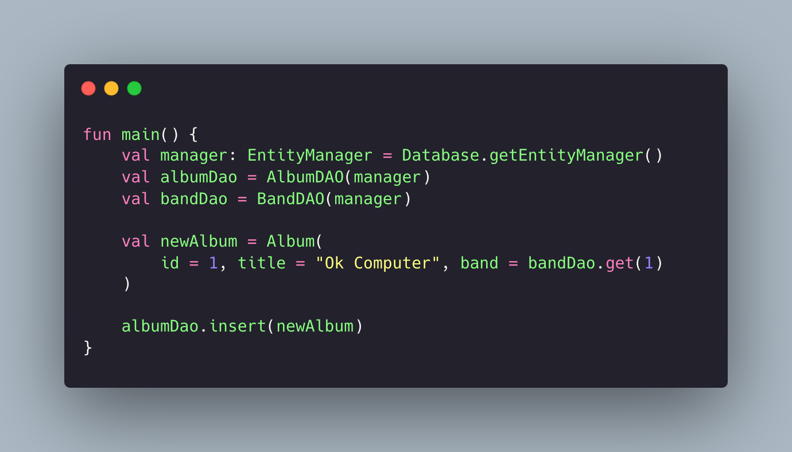

# Data Persistence with Hibernate in Kotlin challenge

<p align="center">
  
</p>

## Index

* [Getting started](#%EF%B8%8F-getting-started)
* [ Technologies used](#%EF%B8%8F-technologies-used)
* [ Tools used](#%EF%B8%8F-tools-used)
* [Services used](#-services-used)
* [Project features](#-project-features-and-characteristics)
* [Project access](#-project-access)
* [Author](#-author)
* [Contact](#%EF%B8%8F-contact)

## ⚙️ Getting started

Alura's Data Persistence with Hibernate course in Kotlin challenge. The objective was to create a simple CRUD
system
for bands and albums, using Hibernate to manage the queries and applying important object-oriented concepts.

## 🖥️ Technologies used

- [`Kotlin`](https://kotlinlang.org/)
- [`Hibernate`](https://hibernate.org/)
- [`Maven`](https://kotlinlang.org/docs/maven.html)

## 🛠️ Tools used

- [`Intellij IDEA`](https://lp.jetbrains.com/intellij-idea-features-promo/?msclkid=407245b505f21915c51423daa28a9529&utm_source=bing&utm_medium=cpc&utm_campaign=AMER_en_BR_IDEA_Branded&utm_term=intellij%20IDEA&utm_content=intellij%20idea)

## 🧰 Services used

- [`Github`](https://github.com)

## 🪚 Project features and characteristics

- SOLID concepts
- Data Persistence
- Use of JPA and Hibernate
- Use of Generic Types
- Generic Types
- Clean Code and Code Optimization

## 📂 Project access

Download the source code
using [this link](https://github.com/gustavotht21/desafio-kotlin-persistindo-dados-hibernate/archive/refs/heads/main.zip)
or clone it from this repository by running:

```bash
git clone https://github.com/gustavotht21/desafio-kotlin-persistindo-dados-hibernate.git
```

The project database feature tests are in the src/test directory. You can run the files inside there to see what the
project does.

## 👤 Author

| [<br><sub>Gustavo Casagrande Borges</sub>](https://github.com/gustavotht21) |  
|:------------------------------------------------------------------------------------------------------------------------------------:| 

## ✉️ Contact

Contact me using e-mail: <a href="mailto:borges.gustavo@estudante.ifro.edu.br">borges.gustavo@estudante.ifro.edu.br</a>
